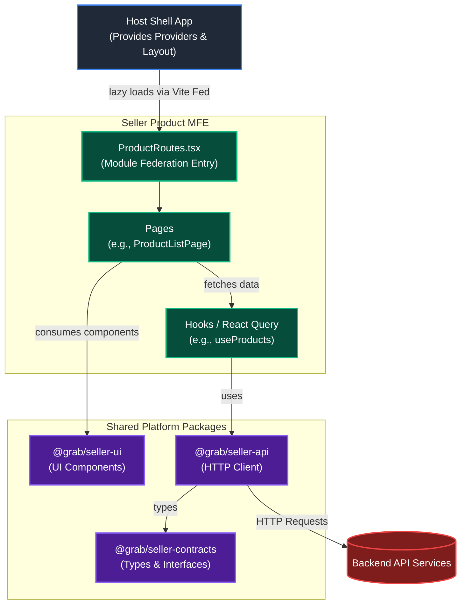

# Seller Product MFE

The Seller Product Micro-Frontend (MFE) handles all product management capabilities, including product list viewing, creation, editing, category selection, and product variation management. 

It was extracted from the monolithic `seller-mfe` repository to enable independent development and deployment as part of a federated frontend architecture.

## 🏗 Architecture

This project is built using **Vite** and **Module Federation**.

### Micro-Frontend Integration
- **Federated Entry**: The MFE exposes its core routing logic via `src/app/ProductRoutes.tsx` as the `seller_product/Routes` module. When consumed by the host shell application, it relies on the shell to provide the top-level context providers (e.g., Router, React Query Client, Theme Provider).
- **Standalone Mode**: For isolated local development, `src/app/StandaloneApp.tsx` acts as the root. It wraps the `ProductRoutes` with all necessary providers (`BrowserRouter`, `QueryClientProvider`, `ThemeProvider`), simulating the shell environment so developers can work without spinning up the whole platform.

### Package Structure

The codebase is organized using a domain-driven, feature-sliced architecture. All product-related functionality is tightly encapsulated inside `src/features/products/`:

```text
src/
├── app/
│   ├── ProductRoutes.tsx      # Federated Entry point (Routes)
│   └── StandaloneApp.tsx      # Standalone dev entry point
├── features/products/
│   ├── adapters/              # Data transformation between API models & UI forms
│   ├── api/                   # API client definitions & request fetchers
│   ├── components/            # Domain-specific UI components (e.g. product-table)
│   ├── hooks/                 # Business logic & React Query wrappers
│   ├── pages/                 # Route-level container components
│   ├── types/                 # Local data models, augmentations to global contracts
│   └── utils.ts               # Feature-specific utility functions
├── test/                      # MSW server and testing setup
├── main.tsx                   # Entry file for Vite dev server
└── styles.css                 # Global tailwind imports
```

### Architecture Flow

The following diagram illustrates how the MFE is consumed by the Host Shell and interacts with the shared platform packages:



## 🚀 Development

### Running Locally
To run the MFE in standalone mode for local development:
```bash
npm run dev
```
This will start the Vite dev server on port `3001` and render the `StandaloneApp`.

### Testing & Building
- **Run Tests**: `npm run test` (powered by Vitest and MSW)
- **Typecheck**: `npm run typecheck`
- **Build**: `npm run build` (outputs federated assets to `dist/`)
